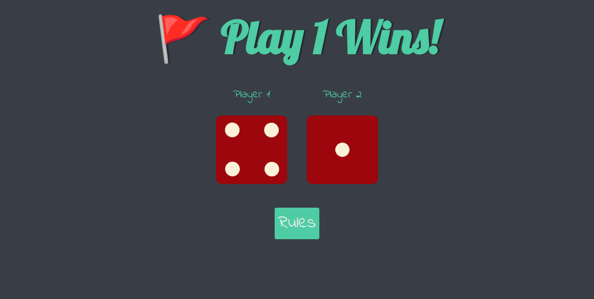
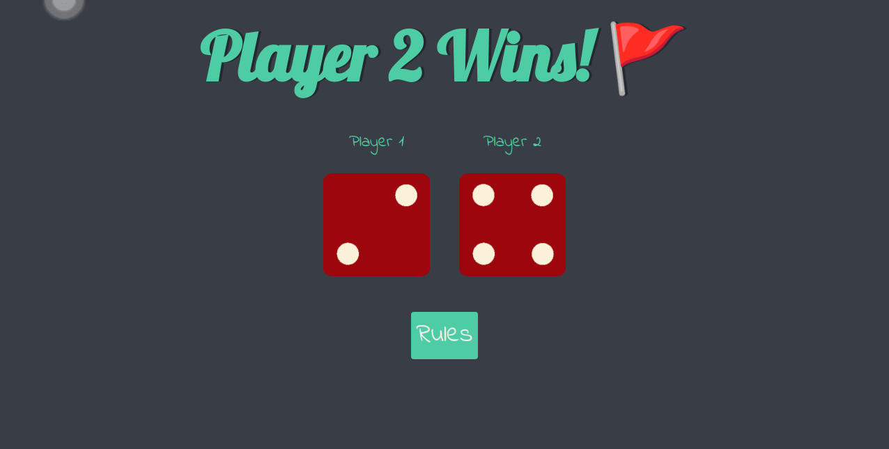
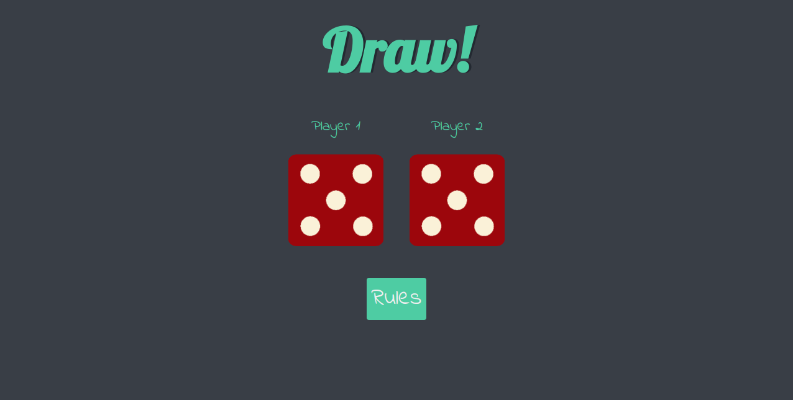
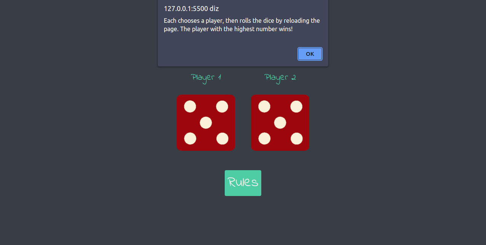

# Dicee

Dicee é um jogo de navegador feito em javascript com HTML e CSS. O jogo consiste em dois dados que são rolados ao recarregar a pagina são "randomicamente" definidos e comparados. O jogo é feito para dois jogadores, e o jogador que tiver o maior número no dado vence.

## Screenshot

### Player one wins

### Player two wins

### Draw

### Rules
